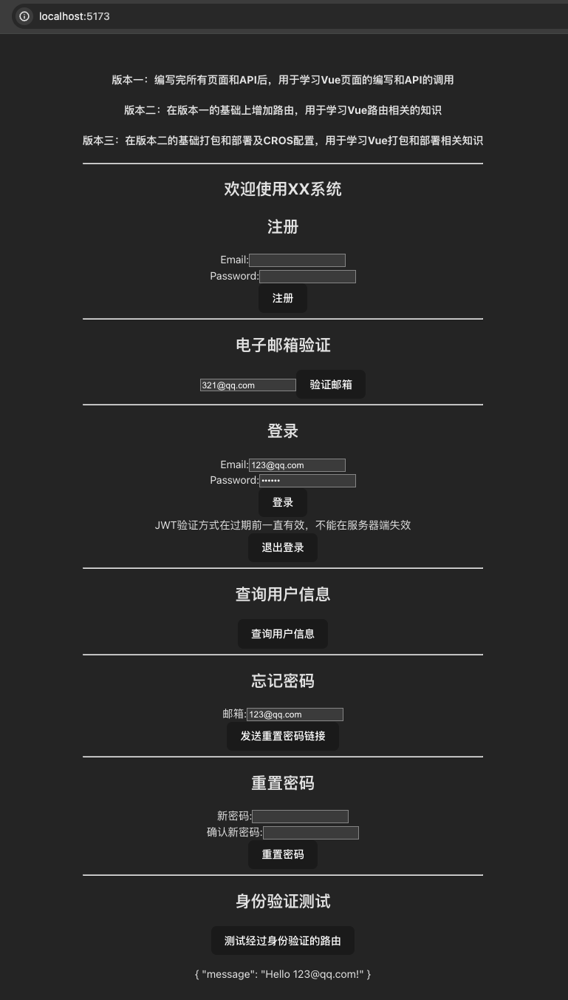
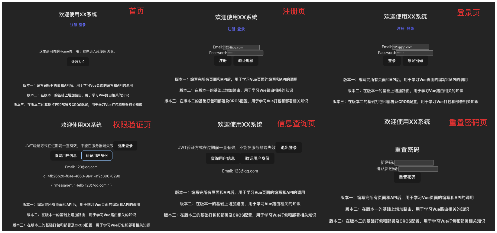

## 用于学习后端Python + 前端Vue+Vite作为后端编写的用户管理系统

#### 版本说明

版本一：编写完所有页面和API后，用于学习Vue页面的编写和API的调用  
版本二：在版本一的基础上增加路由，用于学习Vue路由相关的知识  
版本三：在版本二的基础打包和部署及CROS配置，用于学习Vue打包和部署相关知识  

#### 使用说明

安装Python环境

```bash
cd 项目根目录
pip install -r requirements.txt
```

安装前端环境

```bash
cd 项目根目录/web
npm install
```

运行Python后端

```bash
cd 项目根目录
python main.py
```

运行前端

```bash
cd 项目根目录/web
npm run dev
```

打开浏览器访问http://localhost:5173/

#### 版本一


#### 版本二


#### 版本三
增加服务器CROS配置，并修改项目代码为部署形式。

```bash
# 第一步：在版本二的基础上修改本地服务地址为线上服务器地址
# 增加后端CROS配置，允许前端部署服务器地址 + 端口
# 修改前端CROS配置，允许后端部署服务器地址 + 端口
# 第二步：运行后端服务
cd 项目根目录
python main.py
# 第三步：打包前端
cd 项目根目录/web
npm run build
# 第四步：运行前端服务
docker run --name nginx-test -v "$PWD/web/dist:/usr/share/nginx/html" -p 10000:80 -d nginx
```